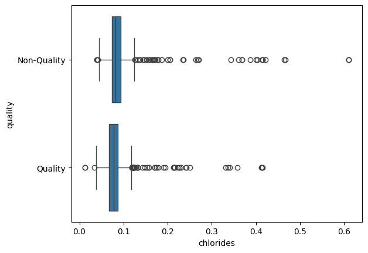
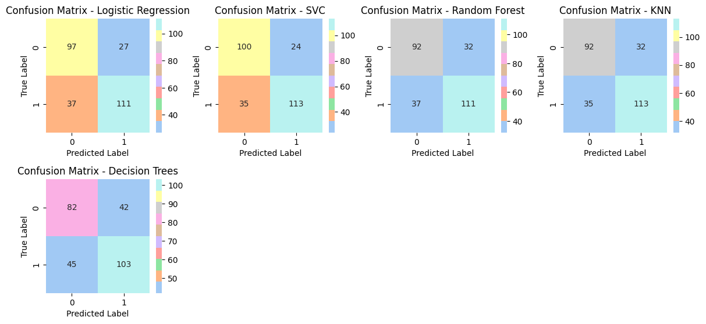

# Classification of Red Wine Quality

This project aims to apply data analysis, data visualization and machine learning algorithms to determine the quality of red wines. 

- Source: https://www.kaggle.com/datasets/uciml/red-wine-quality-cortez-et-al-2009

- You can view the Project Presentation here: https://1drv.ms/p/c/09efa3348145a15f/EZO-TAHCGORGjLni4T6joRsBzQtC7FfKNAhhPBJtv5Jllw?e=GmCCSM&nav=eyJzSWQiOjI1Nn0
          
- Additional Information: In the data processing section, that is, in the "2_analysis.ipynb" file, the file in which I experimented with the transformations on the variables, examined the normalization graphs and decided whether it was suitable or not is "trials.ipynb" and "chlorides.ipynb".

### Project Description

- The quality of red wine was rated by a group of observers (3-8). Our data is real dataset and I got it from Kaggle. In our data set, the amount of chemical variables in the wine is available and each wine is scored according to its taste.

### Steps Involved
1. Dataset Examination and Exploratory Data Analysis (https://github.com/BusraSarikaya1/Final_project/blob/main/analysis_file/1_analysis.ipynb)
	 - Get the dataset from the source and read it.
     - View the first few rows of the dataset.
     - Analyze the shape of the dataset (number of rows and columns).
     - Let's check the data types of each column and look at general information about the data.
	 - Examining the general statistical information of the data we work with.
	 - Using a pie chart and bar chart, let's visualize the ranges in which the wine qualities scores are distributed.
	 - Examine the relationship between the target variable quality and other variables.
	 - Examine the relationship of all variables with each other with the heat map.
	 - Visualize the relationship between the variables that we think are most related to each other with regression graphs.
	 - Let's examine the density charts and box plots according to the scores given to the wines. Check it out.

2. Data Preprocessing and Data Preparation:(https://github.com/BusraSarikaya1/Final_project/blob/main/analysis_file/2_analysis.ipynb)
     - The scored quality target variable was classified as our quality and quality and was recorded in the master data.
	 - Bar and pie chart visualization presented.
	 - Box plot images were examined for outlier analysis.
	 - Univariate outlier analysis was performed.
	 - Independent variables that did not appear to be outliers were examined with the help of the Grubbs Test.
	 - Outlier analysis for both Categorical and numerical variables.
	 - Whether or not the quarterly gap method should be applied for all variables was checked one by one. The density graphs were checked before and after application.(https://github.com/BusraSarikaya1/Final_project/blob/main/trials.ipynb) and https://github.com/BusraSarikaya1/Final_project/blob/main/chlorides.ipynb for chlorides feature.
	 - Duplicating values were removed from the data.
	 - Clean data was created.

3. Model Training and Evaluation:(https://github.com/BusraSarikaya1/Final_project/blob/main/analysis_file/3_analysisd.ipynb)
     - The dependent (target) variable and independent variables were determined.
	 - Data in the independent variables were normalized.
	 - The data were divided into training and test sets.
	 - The model was created using these algorithms: Logistic Regression, Support Vector Classifier, Random Forest, Decision Trees.
	 - The evaluation metrics of the model were examined.

Project Results

- As a result of the analyzes carried out within the scope of the project and the machine learning algorithms applied, the following main results were obtained:

1) Data Analysis and Visualization: Analyzes on the dataset helped us identify important factors affecting wine quality. In particular, alcohol content, acidity level and pH value were found to have a significant impact on wine quality.

Among all the features, the interquartile range method was only applied to chlorides because it made the shape of the graph suitable for normalization.

We can see this improvement by examining the box plot method.

2) Machine Learning Model Performance: Among the applied machine learning algorithms, the Support Vector Classifier algorithm showed the best performance. These models achieved an accuracy rate of 78% and above on the test data set. Additionally, as a result of a comprehensive evaluation of the model performance, it was determined that the model successfully classified wine quality in general.
- The most successful model turned out to be the Support Vector Classifier.
- When looking at the confusion matrix, the model correctly predicted 100 out of 124 low-quality wines and 113 out of 148 high-quality wines from the actual data. The accuracy value is also higher than the other models.

Suggestions
To improve wine quality, optimal values of certain components (for example, alcohol content) can be targeted or production processes can be improved.

